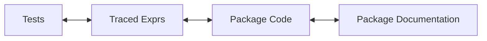

<!-- README.md is generated from README.Rmd. Please edit that file -->

# covtracer <a href='https://github.com/genentech/covtracer'></a>

<!-- badges: start -->

[](https://cran.r-project.org/package=covtracer)
[](https://github.com/genentech/covtracer/actions/workflows/R-CMD-check.yaml)
[](https://app.codecov.io/gh/genentech/covtracer)
<!-- badges: end -->

Tools for contextualizing tests, built using `covr` test traces. This
package provides utilities for linking an assortment of test and package
information to paint a more complete picture of how a test was
performed.



## Installation

To install, use `remotes` to install directly from
[GitHub](https://github.com/Genentech/covtracer)

Functionality hinges heavily on coverage objects prepared using `covr`
(≥ 3.5.1.9003). To ensure suggested dependency requirements are met,
install with `dependencies = TRUE` (satisfy all dependencies).

``` r
# will install covr >= v3.5.1.9003 for examples
remotes::install_github("Genentech/covtracer", dependencies = TRUE)
```

## Motivation

Tests are not black boxes. When it comes to verifying behaviors of code,
we can use observations about the code that is executed by a test to
build a more complete picture of exactly what the test does. This is a
core part of software validation. By combining information about each
test, the tested package code and linking that code to package
documentation, we can link documented behaviors to their respective
tests.

## Getting Started

Test traces are connected to evaluated code using `covr` (≥ 3.5.1.9003).
Likewise, a new option flag (`covr.record_tests`) must be set in order
to record tests alongside the coverage traces. Finally, the package to
evaluate must be installed with source references in order to map all
the components together.

That’s a lot to configure, but if you’re in a position where this test
data is valuable hopefully it’s worth the setup.

``` r
library(covtracer)

# additional demo packages
library(dplyr)
library(withr)
library(covr)

withr::with_temp_libpaths({
  pkg <- system.file("examplepkg", package = "covtracer")

  install.packages(
    pkg,
    type = "source",
    repos = NULL,
    quiet = TRUE,
    INSTALL_opts = c("--with-keep.source", "--install-tests")
  )

  options(covr.record_tests = TRUE)
  cov <- covr::package_coverage(pkg)

  ttdf <- test_trace_df(cov)
})
```

There’s a lot of info in the resulting `data.frame`, but we’ll focus on
just the critical piece, showing which tests evaluate code related to
which documented behaviors. Below we show how one might map unit tests
to evaluated, documented objects.

> **Note:** Below we ignore documentation for datasets and S4 class
> constructors. Although these are defined in the package, they don’t
> map to testable lines of code because they are constructed when the
> package is built.

``` r
traceability_matrix <- ttdf %>%
  filter(!doctype %in% c("data", "class")) %>% # ignore objects without testable code
  select(test_name, file) %>%
  filter(!duplicated(.)) %>%
  arrange(file)

traceability_matrix
#>                                            test_name                       file
#> 1  Example R6 Person class public methods are traced             Accumulator.Rd
#> 2           S4Example increment generic method works                  Person.Rd
#> 3  Example R6 Person class public methods are traced                  Person.Rd
#> 4           S4Example increment generic method works                   Rando.Rd
#> 5                                               <NA>                   Rando.Rd
#> 6                                               <NA>                   adder.Rd
#> 7           S4Example increment generic method works                   adder.Rd
#> 8           S4Example increment generic method works      complex_call_stack.Rd
#> 9           S4Example increment generic method works  deeper_nested_function.Rd
#> 10          S4Example increment generic method works              hypotenuse.Rd
#> 11          S4Example increment generic method works               increment.Rd
#> 12                      S4Example names method works  names-S4Example-method.Rd
#> 13                                              <NA> names-S4Example2-method.Rd
#> 14          S4Example increment generic method works         nested_function.Rd
#> 15                                              <NA>              rd_sampler.Rd
#> 16          S4Example increment generic method works      recursive_function.Rd
#> 17                                              <NA>        reexport_example.Rd
#> 18                                              <NA>               reexports.Rd
#> 19          S4Example increment generic method works         s3_example_func.Rd
#> 20              S4 Generic Call: show(<myS4Example>)   show-S4Example-method.Rd
#> 21                                              <NA>                       <NA>
```

We can quickly see which functions or methods are entirely untested.

## Use Cases

The `data.frame` returned by `test_trace_df` contains a ton of
information, and we can measure a few dimensions of the quality of tests
with some relatively straightforward analysis.

### Traceability Matrix

Perhaps the most immediate use case is to map unit tests to documented
behaviors.

``` r
ttdf %>%
  filter(!doctype %in% c("data", "class")) %>% # ignore objects without testable code
  select(test_name, file) %>%
  filter(!duplicated(.)) %>%
  arrange(file)
#>                                            test_name                       file
#> 1  Example R6 Person class public methods are traced             Accumulator.Rd
#> 2           S4Example increment generic method works                  Person.Rd
#> 3  Example R6 Person class public methods are traced                  Person.Rd
#> 4           S4Example increment generic method works                   Rando.Rd
#> 5                                               <NA>                   Rando.Rd
#> 6                                               <NA>                   adder.Rd
#> 7           S4Example increment generic method works                   adder.Rd
#> 8           S4Example increment generic method works      complex_call_stack.Rd
#> 9           S4Example increment generic method works  deeper_nested_function.Rd
#> 10          S4Example increment generic method works              hypotenuse.Rd
#> 11          S4Example increment generic method works               increment.Rd
#> 12                      S4Example names method works  names-S4Example-method.Rd
#> 13                                              <NA> names-S4Example2-method.Rd
#> 14          S4Example increment generic method works         nested_function.Rd
#> 15                                              <NA>              rd_sampler.Rd
#> 16          S4Example increment generic method works      recursive_function.Rd
#> 17                                              <NA>        reexport_example.Rd
#> 18                                              <NA>               reexports.Rd
#> 19          S4Example increment generic method works         s3_example_func.Rd
#> 20              S4 Generic Call: show(<myS4Example>)   show-S4Example-method.Rd
#> 21                                              <NA>                       <NA>
```

### Finding Untested Behaviors

Once we can map unit testing to documentation, we can filter down to
only documentation that is not covered by any test.

``` r
ttdf %>%
  filter(!doctype %in% c("data", "class")) %>% # ignore objects without testable code
  select(test_name, count, alias, file) %>%
  filter(is.na(count)) %>%
  arrange(alias)
#>   test_name count                   alias                       file
#> 1      <NA>    NA                   Rando                   Rando.Rd
#> 2      <NA>    NA                   adder                   adder.Rd
#> 3      <NA>    NA                    help               reexports.Rd
#> 4      <NA>    NA names,S4Example2-method names-S4Example2-method.Rd
#> 5      <NA>    NA                  person                       <NA>
#> 6      <NA>    NA              rd_sampler              rd_sampler.Rd
#> 7      <NA>    NA        reexport_example        reexport_example.Rd
#> 8      <NA>    NA               reexports               reexports.Rd
```

### Filter For Only Directly Tested Behaviors

Some tests evaluate a broad set of functionality by calling functions
that themselves call out to internal package functions. This is often
perfectly fine, since the mechanisms of calling those internal functions
are limited by the surfaced user-facing functions. Nevertheless, whether
a function is called directly is a good indication of the “unit”-ness of
a unit test. You may consider only the coverage of directly tested
functions.

``` r
ttdf %>%
  filter(!doctype %in% c("data", "class")) %>% # ignore objects without testable code
  select(direct, alias) %>%
  group_by(alias) %>%
  summarize(any_direct_tests = any(direct, na.rm = TRUE)) %>%
  arrange(alias)
#> # A tibble: 21 × 2
#>   alias              any_direct_tests
#>   <chr>              <lgl>           
#> 1 Accumulator        TRUE            
#> 2 Person             TRUE            
#> 3 Rando              TRUE            
#> 4 adder              TRUE            
#> 5 complex_call_stack TRUE            
#> # ℹ 16 more rows
```
