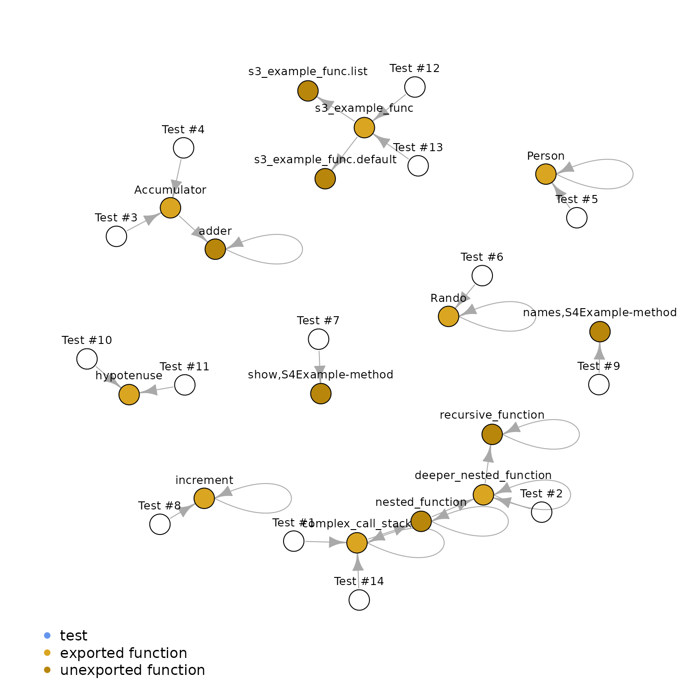

# Plotting Test Paths

## Setup

As with all covtracer analysis, we need to start by collecting coverage
traces of a package. Below is an example where a package is installed
with the necessary flags such that the coverage traces can be collected.

``` r
library(covtracer)

library(withr)
library(covr)
```

``` r
options(keep.source = TRUE, keep.source.pkg = TRUE, covr.record_tests = TRUE)
examplepkg_source_path <- system.file("examplepkg", package = "covtracer")

install.packages(
  examplepkg_source_path,
  type = "source",
  repos = NULL,
  quiet = TRUE,
  INSTALL_opts = c("--with-keep.source", "--install-tests")
)

examplepkg_cov <- covr::package_coverage(examplepkg_source_path)
examplepkg_ns <- getNamespace("examplepkg")

ttdf <- covtracer::test_trace_df(examplepkg_cov, aggregate_by = NULL)
```

As well, for this analysis we will use a few supporting packages.

``` r
library(dplyr)
#> 
#> Attaching package: 'dplyr'
#> The following objects are masked from 'package:stats':
#> 
#>     filter, lag
#> The following objects are masked from 'package:base':
#> 
#>     intersect, setdiff, setequal, union
library(igraph)
#> 
#> Attaching package: 'igraph'
#> The following objects are masked from 'package:dplyr':
#> 
#>     as_data_frame, groups, union
#> The following objects are masked from 'package:stats':
#> 
#>     decompose, spectrum
#> The following object is masked from 'package:base':
#> 
#>     union
```

## Preparing Graph Data

Before we use the test data, we will clean our incoming data, removing
untested records and filtering out untestable objects like S4 class
definitions.

``` r
ttdf <- ttdf %>%
  filter(!is.na(test_name)) %>%
  filter(is.na(doctype) | !doctype %in% "class") %>%
  select(test_name, alias, is_exported, i) %>%
  arrange(test_name, i) %>%
  mutate(test_id = cumsum(!duplicated(test_name)))

head(ttdf)
#>                                      test_name                  alias is_exported i test_id
#> 1 Calling a deeply nested series of functions.     complex_call_stack        TRUE 1       1
#> 2 Calling a deeply nested series of functions.        nested_function       FALSE 2       1
#> 3 Calling a deeply nested series of functions. deeper_nested_function        TRUE 3       1
#> 4 Calling a deeply nested series of functions.     recursive_function       FALSE 4       1
#> 5 Calling a deeply nested series of functions.     recursive_function       FALSE 5       1
#> 6 Calling a deeply nested series of functions.     recursive_function       FALSE 6       1
```

## Create Edges of Our Test Path

Our test-trace dataframe has an index of test expressions, each linked
to the traces that they evaluate, with added order of evaluation, `i`.
To prepare this for visualization, we want to convert this to a
dataframe where each record describes a step of this process. Instead of
a test linking to a trace with an index, each jump in the test path
should link from the calling expression to the evaluated expression.

``` r
edges_df <- ttdf %>%
  split(.$test_name) %>%
  lapply(function(sdf) {
    unique(data.frame(
      from = c(sdf$test_name[[1L]], head(sdf$alias, -1L)),
      to = sdf$alias
    ))
  }) %>%
  bind_rows() %>%
  distinct()

head(edges_df)
#>                                             from                     to
#> 1   Calling a deeply nested series of functions.     complex_call_stack
#> 2                             complex_call_stack        nested_function
#> 3                                nested_function deeper_nested_function
#> 4                         deeper_nested_function     recursive_function
#> 5                             recursive_function     recursive_function
#> 6 Calling a function halfway through call stack. deeper_nested_function
```

Likewise, we want to capture some metadata about each vertex. Since a
vertex in this context can be either a test or a trace, we have some
data that is captured differently for each class of vertex.

``` r
test_names <- Filter(Negate(is.na), unique(ttdf$test_name))
obj_names <- Filter(Negate(is.na), unique(ttdf$alias))

n_tests <- length(test_names)
n_objs <- length(obj_names)

vertices_df <- data.frame(
  name = c(test_names, obj_names),
  color = rep(c("cornflowerblue", "darkgoldenrod"), times = c(n_tests, n_objs)),
  label = c(sprintf("Test #%d", seq_along(test_names)), obj_names),
  test_id = c(seq_along(test_names), rep_len(NA, n_objs)),
  is_test = rep(c(TRUE, FALSE), times = c(n_tests, n_objs)),
  is_exported = c(rep_len(NA, n_tests), ttdf$is_exported[match(obj_names, ttdf$alias)])
)

vertices_df <- vertices_df %>%
  mutate(color = ifelse(is_exported, "goldenrod", color))

vertices_df %>%
  select(name, label) %>%
  head()
#>                                                       name   label
#> 1             Calling a deeply nested series of functions. Test #1
#> 2           Calling a function halfway through call stack. Test #2
#> 3       Example R6 Accumulator class constructor is traced Test #3
#> 4          Example R6 Accumulator class methods are traced Test #4
#> 5        Example R6 Person class public methods are traced Test #5
#> 6 Example R6 Rando class active field functions are traced Test #6
```

## Plotting Our Test Paths

Finally, we can plot this network of test executions:

``` r
g <- igraph::graph_from_data_frame(edges_df, vertices = vertices_df)

par(mai = rep(0, 4), omi = rep(0, 4L))
plot.igraph(g,
  vertex.size = 8,
  vertex.label = V(g)$label,
  vertex.color = V(g)$color,
  vertex.label.family = "sans",
  vertex.label.color = "black",
  vertex.label.dist = 1,
  vertex.label.degree = -pi / 2,
  vertex.label.cex = 0.8,
  mark.border = NA,
  margin = c(0, 0.2, 0, 0.2)
)

legend(
  "bottomleft",
  inset = c(0.05, 0),
  legend = c("test", "exported function", "unexported function"),
  col = c("cornflowerblue", "goldenrod", "darkgoldenrod"),
  pch = 16,
  bty = "n"
)
```



Naturally, there are a plethora of wonderful visualization packages
available that accept igraph data as input. This graph could just as
well be plotted with the `visNetwork` package, though it is omitted to
keep this example analysis minimal.
